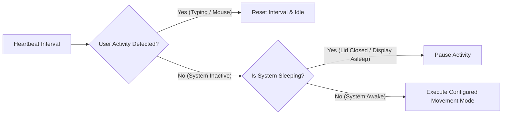

<div align="center">


# Automatic Mouse Mover

### Stay active. Stay focused.

**A lightweight, native macOS menu bar utility that intelligently simulates cursor activity when you're away.**

<p>
  <a href="https://github.com/samlara32/automatic-mouse-mover/releases/latest">
    
  </a>
  <a href="https://github.com/samlara32/automatic-mouse-mover">
    
  </a>
</p>

<p>
  
  
  
</p>

<br>


</div>

---

## Why AMM?

Traditional keep-awake utilities are designed to prevent your Mac from sleeping. They don't keep your **workplace presence active**.

Applications such as Slack, Microsoft Teams, and Discord detect inactivity independently and change your status to **Away**.

**Automatic Mouse Mover (AMM)** monitors your activity and only simulates subtle cursor movement when you've been idle — while automatically pausing when you return or when macOS enters a sleep state.

> **No unnecessary movement. No background network activity. No tracking.**

### Comparison

| Capability | Standard Keep-Awake Utilities | Automatic Mouse Mover (AMM) |
| :--- | :---: | :---: |
| Prevents Display Sleep | <picture><source media="(prefers-color-scheme: dark)" srcset="https://api.iconify.design/lucide:check.svg?color=%233FB950"><source media="(prefers-color-scheme: light)" srcset="https://api.iconify.design/lucide:check.svg?color=%231A7F37"></picture> Yes | <picture><source media="(prefers-color-scheme: dark)" srcset="https://api.iconify.design/lucide:check.svg?color=%233FB950"><source media="(prefers-color-scheme: light)" srcset="https://api.iconify.design/lucide:check.svg?color=%231A7F37"></picture> Yes |
| Keeps Slack / Teams Active | <picture><source media="(prefers-color-scheme: dark)" srcset="https://api.iconify.design/lucide:x.svg?color=%23F85149"><source media="(prefers-color-scheme: light)" srcset="https://api.iconify.design/lucide:x.svg?color=%23CF222E"></picture> No (Status becomes Away) | <picture><source media="(prefers-color-scheme: dark)" srcset="https://api.iconify.design/lucide:check.svg?color=%233FB950"><source media="(prefers-color-scheme: light)" srcset="https://api.iconify.design/lucide:check.svg?color=%231A7F37"></picture> Yes (Status remains Active) |
| Smart Inactivity Detection | <picture><source media="(prefers-color-scheme: dark)" srcset="https://api.iconify.design/lucide:x.svg?color=%23F85149"><source media="(prefers-color-scheme: light)" srcset="https://api.iconify.design/lucide:x.svg?color=%23CF222E"></picture> No (Runs continuously) | <picture><source media="(prefers-color-scheme: dark)" srcset="https://api.iconify.design/lucide:check.svg?color=%233FB950"><source media="(prefers-color-scheme: light)" srcset="https://api.iconify.design/lucide:check.svg?color=%231A7F37"></picture> Yes (Only triggers when idle) |
| Micro-Nudge Mode | <picture><source media="(prefers-color-scheme: dark)" srcset="https://api.iconify.design/lucide:x.svg?color=%23F85149"><source media="(prefers-color-scheme: light)" srcset="https://api.iconify.design/lucide:x.svg?color=%23CF222E"></picture> No | <picture><source media="(prefers-color-scheme: dark)" srcset="https://api.iconify.design/lucide:check.svg?color=%233FB950"><source media="(prefers-color-scheme: light)" srcset="https://api.iconify.design/lucide:check.svg?color=%231A7F37"></picture> Yes (1 px imperceptible shift) |
| System Sleep / Lid Close Awareness | <picture><source media="(prefers-color-scheme: dark)" srcset="https://api.iconify.design/lucide:x.svg?color=%23F85149"><source media="(prefers-color-scheme: light)" srcset="https://api.iconify.design/lucide:x.svg?color=%23CF222E"></picture> No | <picture><source media="(prefers-color-scheme: dark)" srcset="https://api.iconify.design/lucide:check.svg?color=%233FB950"><source media="(prefers-color-scheme: light)" srcset="https://api.iconify.design/lucide:check.svg?color=%231A7F37"></picture> Yes (Automatically pauses) |
| Native Apple Silicon Architecture | Varies (often x86 / Electron) | <picture><source media="(prefers-color-scheme: dark)" srcset="https://api.iconify.design/lucide:check.svg?color=%233FB950"><source media="(prefers-color-scheme: light)" srcset="https://api.iconify.design/lucide:check.svg?color=%231A7F37"></picture> Yes (Universal Mach-O binary) |

---

## <picture><source media="(prefers-color-scheme: dark)" srcset="https://api.iconify.design/lucide:sparkles.svg?color=%2358A6FF"><source media="(prefers-color-scheme: light)" srcset="https://api.iconify.design/lucide:sparkles.svg?color=%230969DA"></picture> Features

- <picture><source media="(prefers-color-scheme: dark)" srcset="https://api.iconify.design/lucide:cpu.svg?color=%2358A6FF"><source media="(prefers-color-scheme: light)" srcset="https://api.iconify.design/lucide:cpu.svg?color=%230969DA"></picture> **Universal 2 Architecture**: Native Mach-O binary compiled for both Apple Silicon (M1/M2/M3/M4) and Intel (x86_64) without Rosetta emulation.
- <picture><source media="(prefers-color-scheme: dark)" srcset="https://api.iconify.design/lucide:clock.svg?color=%2358A6FF"><source media="(prefers-color-scheme: light)" srcset="https://api.iconify.design/lucide:clock.svg?color=%230969DA"></picture> **Configurable Idle Intervals**: Customize idle detection frequency:
  - `30 Seconds`
  - `1 Minute` (Default)
  - `2 Minutes`
  - `5 Minutes`
  - `10 Minutes`
- <picture><source media="(prefers-color-scheme: dark)" srcset="https://api.iconify.design/lucide:mouse-pointer-click.svg?color=%2358A6FF"><source media="(prefers-color-scheme: light)" srcset="https://api.iconify.design/lucide:mouse-pointer-click.svg?color=%230969DA"></picture> **Three Movement Modes**:
  - **Standard (`10 px`)**: Subtle back-and-forth cursor shift.
  - **Micro-Nudge (`1 px`)**: Imperceptible movement that registers as user activity.
  - **Jiggle**: Randomized natural micro-movements.
- <picture><source media="(prefers-color-scheme: dark)" srcset="https://api.iconify.design/lucide:timer.svg?color=%2358A6FF"><source media="(prefers-color-scheme: light)" srcset="https://api.iconify.design/lucide:timer.svg?color=%230969DA"></picture> **Auto-Stop Countdown Timers**: Automatically stops after a specified duration:
  - `30 Minutes`
  - `1 Hour`
  - `2 Hours`
  - `4 Hours`
  - `Continuous` (Default)
- <picture><source media="(prefers-color-scheme: dark)" srcset="https://api.iconify.design/lucide:moon.svg?color=%2358A6FF"><source media="(prefers-color-scheme: light)" srcset="https://api.iconify.design/lucide:moon.svg?color=%230969DA"></picture> **Sleep & Lid Awareness**: Automatically pauses cursor activity when your Mac sleeps or the lid closes via IOKit.
- <picture><source media="(prefers-color-scheme: dark)" srcset="https://api.iconify.design/lucide:apple.svg?color=%2358A6FF"><source media="(prefers-color-scheme: light)" srcset="https://api.iconify.design/lucide:apple.svg?color=%230969DA"></picture> **macOS Human Interface Guidelines Compliance**: Clean menu typography, native checkmark selection indicators, dynamic Light/Dark mode template icons, and background agent mode (`LSUIElement`).
- <picture><source media="(prefers-color-scheme: dark)" srcset="https://api.iconify.design/lucide:key-round.svg?color=%2358A6FF"><source media="(prefers-color-scheme: light)" srcset="https://api.iconify.design/lucide:key-round.svg?color=%230969DA"></picture> **Persistent Code Signing**: Designated requirement identity ensures Accessibility permissions remain valid across rebuilds and updates.
- <picture><source media="(prefers-color-scheme: dark)" srcset="https://api.iconify.design/lucide:shield-check.svg?color=%2358A6FF"><source media="(prefers-color-scheme: light)" srcset="https://api.iconify.design/lucide:shield-check.svg?color=%230969DA"></picture> **Offline & Private**: Zero telemetry, zero analytics, and zero network calls.

---

## <picture><source media="(prefers-color-scheme: dark)" srcset="https://api.iconify.design/lucide:download.svg?color=%2358A6FF"><source media="(prefers-color-scheme: light)" srcset="https://api.iconify.design/lucide:download.svg?color=%230969DA"></picture> Installation

### Option 1: DMG Installer (Recommended)

1. Download the latest **[`AutomaticMouseMover.dmg`](https://github.com/samlara32/automatic-mouse-mover/releases/latest)** from the Releases page.
2. Open the `.dmg` file and drag `amm.app` into your `/Applications` directory.
3. Open `amm` from `/Applications` or Spotlight search.

> [!NOTE]
> If macOS displays an *Unidentified Developer* notice on first launch, Right-Click (or Control-Click) `amm.app` in Finder, select **Open**, and confirm.

---

### Option 2: Build and Install from Source

Requirements: Go 1.23+ and Xcode Command Line Tools (`xcode-select --install`).

```bash
# Clone the repository
git clone https://github.com/samlara32/automatic-mouse-mover.git
cd automatic-mouse-mover

# Compile Universal binary and install to /Applications
make install
```

---

## <picture><source media="(prefers-color-scheme: dark)" srcset="https://api.iconify.design/lucide:lock.svg?color=%2358A6FF"><source media="(prefers-color-scheme: light)" srcset="https://api.iconify.design/lucide:lock.svg?color=%230969DA"></picture> Accessibility Permission

Because macOS restricts automated input simulation, AMM requires standard Accessibility permission:

1. Open **System Settings** -> **Privacy & Security** -> **Accessibility**.
2. Toggle the switch next to **amm** to **ON**.
3. If replacing an older build, click `-` to remove any stale entries, then click `+` and select `/Applications/amm.app`.

---

## <picture><source media="(prefers-color-scheme: dark)" srcset="https://api.iconify.design/lucide:workflow.svg?color=%2358A6FF"><source media="(prefers-color-scheme: light)" srcset="https://api.iconify.design/lucide:workflow.svg?color=%230969DA"></picture> How It Works



1. **Activity Tracker**: AMM queries system event counters (keystrokes, mouse deltas, display state) at the configured interval.
2. **IOKit Sleep Notification**: AMM listens to macOS power management events and pauses when the lid is closed or the computer is put to sleep manually.
3. **CoreGraphics Event Dispatch**: If no user input was detected and the system remains awake, AMM shifts the pointer coordinates according to the selected movement mode.

---

## <picture><source media="(prefers-color-scheme: dark)" srcset="https://api.iconify.design/lucide:terminal.svg?color=%2358A6FF"><source media="(prefers-color-scheme: light)" srcset="https://api.iconify.design/lucide:terminal.svg?color=%230969DA"></picture> Development

The project includes a Makefile for building, testing, and release management:

| Target | Description |
| :--- | :--- |
| `make build` | Compiles the Universal binary (`arm64` + `x86_64`) into `./bin/amm.app`. |
| `make package` | Builds the application and creates `AutomaticMouseMover.dmg`. |
| `make install` | Builds, signs, and installs the application into `/Applications`. |
| `make uninstall` | Terminates running instances, removes `/Applications/amm.app`, and resets TCC permissions. |
| `make test` | Executes unit tests with race detection (`go test -v -race ./...`). |
| `make release` | Interactive terminal prompt to bump version, run tests, and publish a GitHub release. |

---

## <picture><source media="(prefers-color-scheme: dark)" srcset="https://api.iconify.design/lucide:shield-check.svg?color=%2358A6FF"><source media="(prefers-color-scheme: light)" srcset="https://api.iconify.design/lucide:shield-check.svg?color=%230969DA"></picture> Privacy & Security

- **Zero Network Calls**: AMM contains no network libraries, telemetry, crash reporting, or remote connections.
- **Open Source**: Full source code is publicly accessible and auditable.
- **Local Configuration**: Settings are stored locally in `~/.config/amm/settings.json`.

---

## <picture><source media="(prefers-color-scheme: dark)" srcset="https://api.iconify.design/lucide:help-circle.svg?color=%2358A6FF"><source media="(prefers-color-scheme: light)" srcset="https://api.iconify.design/lucide:help-circle.svg?color=%230969DA"></picture> FAQ

**Does AMM move my mouse continuously?**  
No. AMM only performs a subtle movement after you have been completely inactive for your configured interval.

**Does it work natively on Apple Silicon and Intel Macs?**  
Yes. AMM is compiled as a Universal Mach-O binary supporting both `arm64` (M1/M2/M3/M4) and `x86_64`.

**Why is Accessibility permission required?**  
macOS restricts applications from generating synthetic mouse events without explicit user authorization in Privacy & Security.

**Can I set it to stop automatically?**  
Yes. AMM provides configurable countdown stop timers (`30m`, `1h`, `2h`, `4h`, or Continuous).

---

## License

Distributed under the MIT License. See [LICENSE](LICENSE) for details.

*Originally created by [@prashantgupta24](https://github.com/prashantgupta24). Maintained and enhanced by [@samlara32](https://github.com/samlara32).*
